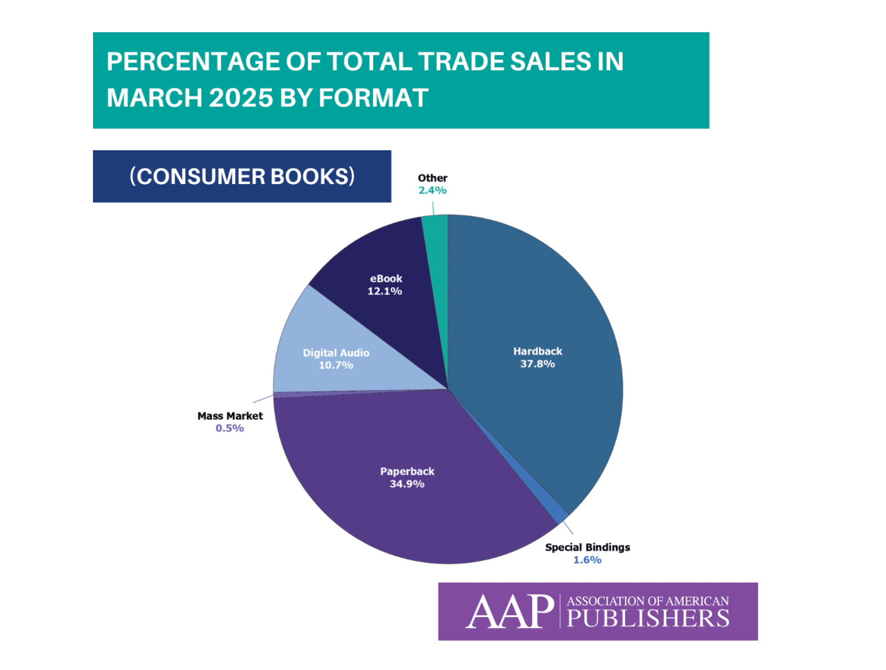
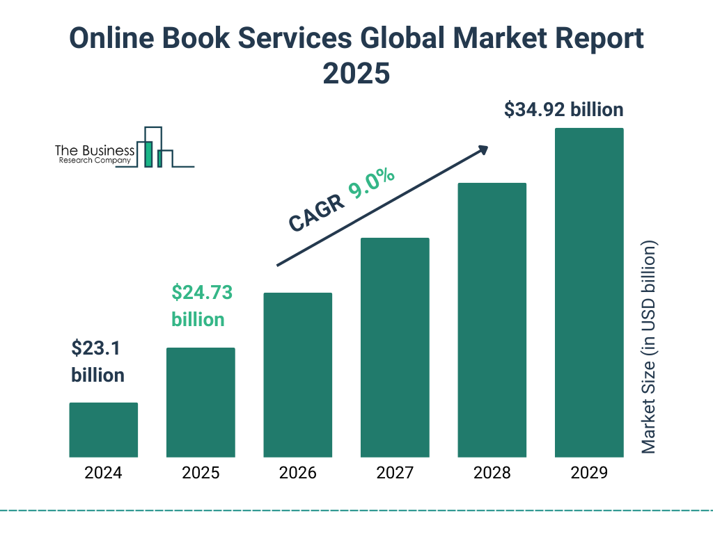

# PageRush

PageRush is a modern, full-stack e-commerce bookstore designed to connect readers and sellers in one seamless platform. Built for speed, reliability, and global accessibility, PageRush enables users to discover, buy, and sell books effortlessly—from new releases to rare editions. The system uses a powerful database structure, scalable APIs, and secure transaction handling to deliver a premium online bookstore experience.

---

## Overview

PageRush serves two primary audiences:

- **Readers and Buyers:** They can browse a vast selection of titles, filter by genre or author, preview book details, and purchase using a secure checkout system.
- **Sellers and Authors:** They can list their books, manage prices, track sales, and interact with customers through a personalized dashboard.

If a requested book is not available on PageRush, the system automatically connects with the **Google Books API**, redirecting users to verified retailers where the title is available. This ensures that every visitor can find exactly what they’re looking for without leaving the PageRush ecosystem.

---

## Technologies and Frameworks

| Component | Technology | Purpose |
|------------|-------------|----------|
| **Frontend** | **EJS (Embedded JavaScript Templates)** | Dynamically renders server-side HTML pages with integrated data |
| **Backend** | **Node.js / Express.js** | Handles routing, authentication, and all API logic |
| **Database** | **MongoDB with Mongoose** | Stores user data, book listings, and transactions; provides schema validation and a backup redundancy layer |
| **Language** | **JavaScript (ES6+)** | Core programming language across both frontend and backend |
| **Uploads** | **Multer** | Handles image uploads for book covers and user profiles |
| **Testing** | **Jest / Supertest (Unit Testing)** | Ensures route reliability and database functionality |
| **Environment Management** | **dotenv** | Secures environment variables such as API keys and connection strings |
| **Development Tools** | **Nodemon** | Restarts the server automatically during development |
| **Deployment** | **GitHub / Firebase / MongoDB Atlas** | Provides continuous integration, hosting, and database access |

These technologies integrate seamlessly into a unified, scalable structure that ensures consistent performance and reliability across all user operations.

---

## Platform Architecture

### 1. Server Layer
The Express.js server manages all routing, middleware, and API endpoints. It handles requests between the client and the database, including:
- Secure user authentication and session management
- API routing for book listings, searches, and transactions
- Method-Override support for PUT and DELETE operations
- Integration with Google Books API for external data sourcing

### 2. Data Layer
The database is powered by MongoDB and structured through Mongoose. This allows schema enforcement, validation, and backup redundancy to prevent data loss. Backups are synchronized regularly, ensuring that the system maintains stability under any conditions.

### 3. Interface Layer
PageRush’s interface is built using EJS templates, providing fast-rendering, SEO-friendly pages with clean design principles. JavaScript ES6 powers dynamic behavior, ensuring a smooth user experience for both buyers and sellers.

---

## Reliability and Security

PageRush is engineered for maximum uptime and data security.  
The system employs:
- Mongoose redundancy and backup replication
- Environment separation for production and development
- SSL encryption and HTTPS routing
- Secure password hashing and session handling

Because of its architecture, downtime is nearly impossible. The combination of **MongoDB Atlas** and **Mongoose** ensures reliable uptime and automatic database recovery if an issue occurs.

---

## Market Research and Industry Data

PageRush enters an expanding digital marketplace with high growth potential.  

### Online Book Services Global Market Report (2025)

According to **The Business Research Company (2025)**, the global online book services market is projected to grow from **$23.1 billion in 2024** to **$34.92 billion by 2029**, representing a compound annual growth rate (CAGR) of **9.0%**.  
This growth highlights the continued rise in online reading and e-commerce activity across the publishing sector.

---

### Book Format Distribution – 2025

Data from the **Association of American Publishers (AAP)** shows the distribution of book formats as follows:
- Hardback: 37.8%  
- Paperback: 34.9%  
- eBook: 12.1%  
- Digital Audio: 10.7%  
- Special Bindings: 1.6%  
- Other: 2.4%  
- Mass Market: 0.5%

These figures reflect a balanced market where both physical and digital formats are thriving, giving PageRush a strategic advantage through its hybrid model.

---

## Supporting Market Insights

- **46%** of global consumers prefer buying books online compared to 36% who buy in physical stores (YouGov Global Study, 2024).  
- The global **online book services market** was valued at **$23.38 billion in 2024** and is projected to exceed **$32 billion by 2030** (Grand View Research).  
- The **eBook segment** alone reached **$18 billion in 2025**, fueled by mobile reading applications and independent publishing platforms (Mordor Intelligence).  
- In the United States, the total book market value is estimated at **$44 billion (2025)** (IBISWorld).  

This data indicates a thriving and expanding market for online bookstores and digital publishing platforms like PageRush.

---

## Development Philosophy

The foundation of PageRush is built on three key principles:

1. **Speed** – Optimized data handling, fast server responses, and minimal latency.  
2. **Reliability** – Dual-database setup, error recovery systems, and comprehensive testing.  
3. **Scalability** – Modular architecture supporting future feature expansion and global scaling.  

These principles ensure that PageRush performs effectively across all user and developer environments.

---

## Testing

PageRush uses **unit testing** with Jest and Supertest to verify that all core functions, API routes, and database interactions operate as expected. This guarantees that updates and new releases remain stable and that the user experience is not disrupted during maintenance or feature additions.

---

## Future Expansion

PageRush is designed to evolve. Planned upgrades include:
- Personalized recommendation systems powered by machine learning  
- Advanced analytics for sellers to track trends and sales performance  
- Integrated review and rating features for community engagement  
- Global multi-language support  
- Expanded API marketplace for publishers and authors  

---

**PageRush** — Built for readers. Trusted by sellers. Powered by technology.
